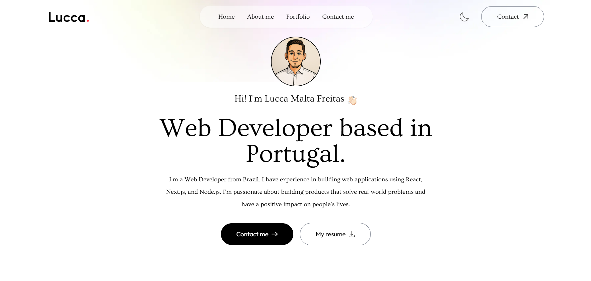

# 🌐 Personal Portfolio – Lucca Malta Freitas

Welcome to my personal developer portfolio!  
This project was built to showcase my skills, experience and recent work as a **Developer based in Portugal**.


## 📌 About the Project

A modern, responsive and animated personal portfolio website built with **React**.  
It includes essential sections to introduce myself, display my latest projects and allow visitors to get in touch.


## 🔧 Technologies Used

- **React.js** – Component‑based UI  
- **Framer Motion** – Smooth and elegant animations  
- **Web3forms** – Contact form (sends messages directly to my email)  
- **Tailwind CSS** – Responsive, utility‑first styling  
- **React Icons**  
- **HTML & CSS**

---

## 🧩 Features

- 📄 **Resume Download** – Button to download my latest CV  
- 🧑‍💻 **About Me** – Introduction, background and skills  
- 🛠️ **Tech Stack Showcase** – Icons illustrating the tools I use  
- 🧾 **Project Portfolio** – Previews of my 4 latest front‑end projects  
- 💬 **Contact Form** – Integrated with EmailJS for direct messaging  
- 🔗 **Social Link** – Quick access to my [LinkedIn](https://www.linkedin.com/in/luccamf/) and Github
- 🌑 **Dark Mode** - Easy acess to dark mode in a button


## 📷 Preview




## 🚀 Getting Started

To run this project locally:
```git
# 1. Clone the repository
git clone https://github.com/your-username/your-repo-name.git

# 2. Enter project folder
cd your-repo-name

# 3. Install dependencies
npm install

# 4. Start development server
npm start
```

## 📫 Contact
If you have any questions or feedback, feel free to reach out:

Email: luccamaltafreitas@gmail.com

---

© 2025 Lucca Malta Freitas. All rights reserved.